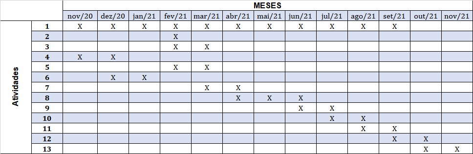

# Plataforma de Simulação e Ensino em Controle

                                                           Visão Geral

O objetivo deste sistema é auxiliar o ensino de controle através de uma plataforma de estudo e simulação.

Integrando um pêndulo invertido em que o estudante possa alterar o controlador da forma que desejar.
E acessar as informações e a câmera remotamente.

                                                            Link do trabalho

https://www.overleaf.com/read/gqqcctcxdmsk

                                                            Links interessantes
http://www.lac.usp.br/pendulo.html

https://www.youtube.com/watch?v=E84x9rKRSSo&feature=youtu.be

https://ctms.engin.umich.edu/CTMS/index.php?example=InvertedPendulum&section=SystemModeling

                                                              Referências

ASSUNÇÃO, E.Projeto de Controladores Robustos H2 ou H via LMI:ControleRobusto. 2018. Material de aula 4. 

ASSUNÇÃO, E.Projeto de Controladores Robustos H2 ou H viaLMI:Estabilidade. 2018. Material de aula 3.  

CARDIM, R.Analise e Projeto de sistemas de controle fuzzy Takashi-Sugenovia LMI:Introdução aos Modelos Fuzzy Takashi-Sugeno. 2020. Material de aula1.  

CARDIM, R.Controle Fuzzy TS de um Pêndulo Invertido. 2020. Material de aula.

FILHO, M. F.Internet das coisas : livro digital. Palhoça: UnisulVirtual, 2016. 56 p.

IEEE Standard for an Architectural Framework for the Internet of Things (IoT).IEEEStd 2413-2019, p. 1–269, March 2020. 

MESSNER, B. et al.Introduction: PID Controller Design. 2019. 
Disponível em:
<https://ctms.engin.umich.edu/CTMS/index.php?example=Introduction&section=ControlPID>. 
Acesso em: 13 de jan. de 2020.  

OGATA, K.Engenharia de Controle Moderno. 5. ed. São Paulo: Pearson Educationdo Brasil, 2010. 809 p.  

SERENI, B.Static Output Feedback Control for LPV and Uncertain LTISystems. Dissertação (Mestrado) — UNESP, Ilha Solteira, 2019.  

SILVA, E. D.A Importância das atividades Experimentais na Educação.Dissertação (Mestrado) — AVM Faculdade Integrada, Rio de Janeiro, 2017.  

SILVA, M. D. Estação iot para monitoramento da temperatura e umidade do interior deveículos. 04 2018. 

SOUZA, W. et al. Robust switched control design for nonlinear systems using fuzzymodels.Mathematical Problems in Engineering, v. 2014, n. 1, p. 1–11, 2014.

TELECO.Relatório do Projeto IoT Brasil. 2016. 
Disponível em: <http://www.telebrasil.org.br/component/docman/doc_download/1569-apresentacao-do-projeto-lot-brasil?Itemid=>. Acesso em: 21 de jan. de2020.  Citado na página 24.

							Cronograma

1. Realizar revisão bibliográfica;
2. Identificar requisitos;
3. Modelar sistema;
4. Definição da planta;
5. Construção da planta;
6. Modelagem da planta;
7. Teste da planta;
8. Backend;
9. Desenvolvimento do aplicativo móvel;
10. Testes com aplicativo móvel;
11. Desenvolvimento do aplicativo web;
12. Teste com aplicativo web;
13. Ensaios e Testes com a planta.
